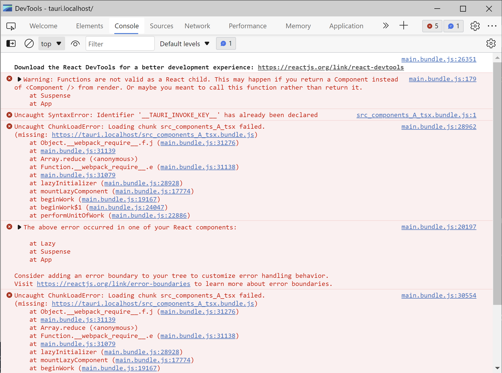

## Code Split Repo

This repository reproduces an issue when working with Webpack + React.Lazy. Tauri is unable to work
properly in production builds, but works fine in development mode.



## How to run

```bash
## For development mode
npm start

## For debug mode
npm run build:dev

# And run the binary (in windows run the .exe)
/src-tauri/target/debug/tauri-helloworld
```

## How to "fix"

To solve the issue simply follow the comments in `src/components/App.tsx` which just disables the
generated chunk from Webpack.
